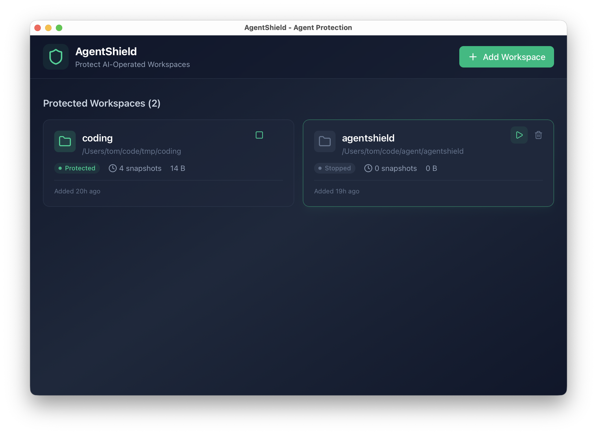

# 🛡️ AgentShield

English | [中文](./README_CN.md)

**The missing safety layer for Claude Code, Cowork, OpenCode and all AI Agents - Your "regret pill" for AI-assisted development.**

A workspace history version management tool that protects your workspace from unintended AI Agent modifications.



## ✨ Features

- **⚡ Zero-Copy Backups** - Uses hardlinks for instant, space-efficient backups
- **🕵️ Real-time Protection** - Watches your workspace and automatically backs up files before changes
- **📦 Smart Exclusions** - Automatically ignores `.git`, `node_modules`, build artifacts, etc.
- **🔒 Atomic Exec Mode** - Snapshot entire workspace before running agent commands
- **⏮️ Easy Restore** - One command to roll back any file to its original state

## 🚀 Installation

### Desktop Version

Download the corresponding platform installation package from the [Releases](https://github.com/tomsun28/agentshield/releases) page and extract it to install (supports Windows, macOS, Linux).

- `shield_desktop_darwin_arm64.dmg` (macOS arm64)
- `shield_desktop_darwin_x64.dmg` (macOS x64)
- `shield_desktop_linux_arm64.tar.gz` (Linux arm64)
- `shield_desktop_linux_x64.tar.gz` (Linux x64)
- `shield_desktop_win_x64.exe` (Windows x64)

For MacOS if you see “AgentShield.app is damaged and can’t be opened”, run the following command in Terminal:
```
sudo xattr -rd com.apple.quarantine /Applications/AgentShield.app
```

### CLI Version

**Via npm installation**

```bash
npm install -g agentshield
```

**Via binary installation**

```bash
curl -fsSL https://github.com/tomsun28/agentshield/raw/main/install.sh | bash
```

Or download the executable binary for your platform from the [Releases](https://github.com/tomsun28/agentshield/releases) page (supports Windows, macOS, Linux).

- `shield_cli_darwin_arm64` (macOS arm64)
- `shield_cli_darwin_x64` (macOS x64)
- `shield_cli_linux_arm64` (Linux arm64)
- `shield_cli_linux_x64` (Linux x64)
- `shield_cli_win_x64.exe` (Windows x64)

## 📖 Usage


### Watch Mode (Workspace Real-time Protection)

> Support background daemon mode `shield start` and foreground mode `shield watch`, choose one.

```bash
# Start background watch (recommended)
shield start

# Start background watch for specific directory
shield start ./my-project

# Watch current directory (foreground)
shield watch

# Watch specific directory (foreground)
shield watch ./my-project

# Stop background process
shield stop
shield stop ./my-project

# Check status
shield status
```

### Restore Files

```bash
# List all changes and snapshot points
shield list

# Restore a specific snapshot by ID or timestamp
shield restore <id>
```

### Status and Cleanup

```bash
# Show backup statistics and daemon status
shield status

# Remove backups older than 7 days (default)
shield clean

# Remove backups older than 3 days
shield clean --days=3
```

## 🤝 Contributing

Issues and Pull Requests are very welcome!

## 📄 License

[Apache License 2.0](./LICENSE)
